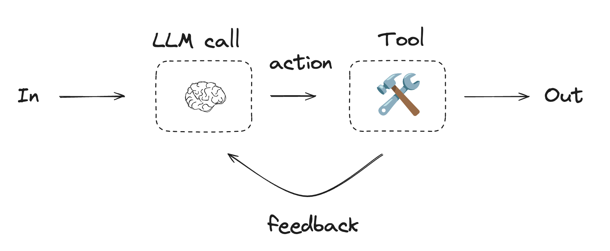
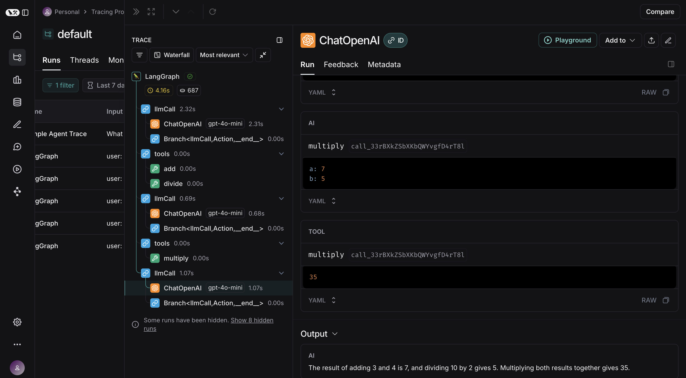
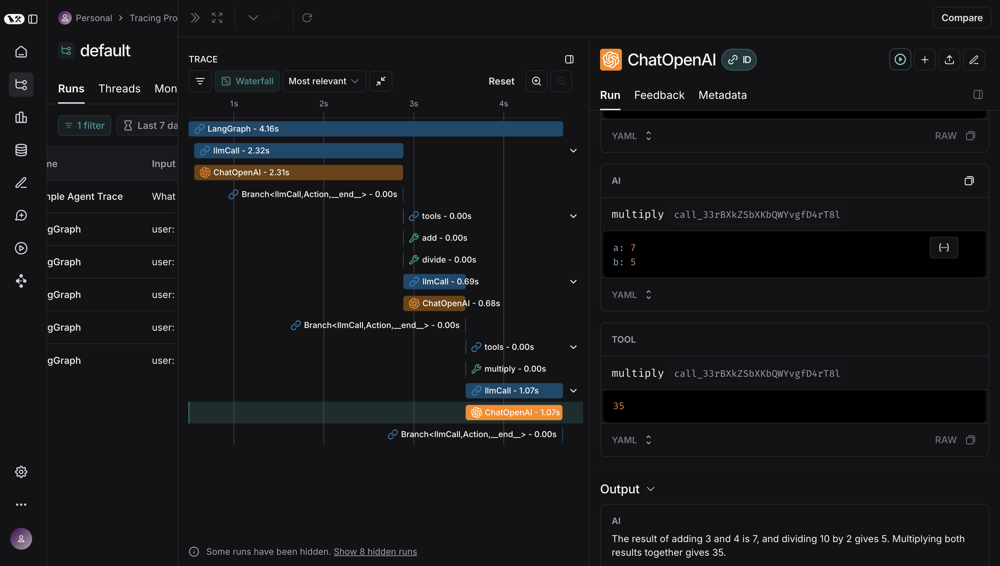

# LangChain, LangGraph & LangSmith
by Gaurav Kabra

We discussed building a simple AI agent [here](https://github.com/kabragaurav/ai-agent).

But to do it at scale, in production, we need above frameworks.

## LangChain

In production, we might be calling different LLM vendors’s APIs (such as OpenAI, Gemini, Claude). They might have different endpoints and signature of request and response also differ. LangChain provides a uniform interface to call these APIs.
Plus it has Community Packages that provide utility methods. For example, you want to feed a PDF or a blog of 1 lac tokens to LLM. Now due to context window limit, you cannot load entire PDF at once. You will need to write logic to chunk it. That utility is already found in community packages.

It is useful where flow is static (well-known) such as on click of button, summarize the entire web page.


## LangGraph

Now some flows are not static (can start and take diverge paths) like in a flight bot:


```
Customer1: I want to do a booking
Customer2: What is status of my flight?
Customer3: I want to do a cancellation
```

We can build a graph of all such possibilities.


## LangSmith

Collects telemetry which helps debug and track performance.


## Setup From Scratch

```
npm install @langchain/langgraph @langchain/openai @langchain/core zod dotenv
```

Create a `.env` file in root directory and add below details:

```
OPENAI_API_KEY=<key>
LANGSMITH_TRACING=true
LANGSMITH_ENDPOINT="https://api.smith.langchain.com"
LANGSMITH_API_KEY=<key>
LANGSMITH_PROJECT=<project>
```

Find the above details by going to [OpenAI Platform](https://platform.openai.com/) and [LangSmith](https://smith.langchain.com/). This will allow debugging using LangSmith.

The code in `index.js` is inspired from [documentation](https://langchain-ai.github.io/langgraphjs/tutorials/workflows/#agent) and [here](https://www.npmjs.com/package/@langchain/openai) and can be visualized as below:



A sample output of `node index.js` is given:

```json
[
  HumanMessage {
    "id": "cf6679db-37f6-4f9a-8c59-c9a5cb654812",
    "content": "First add 3 and 4. Second, divide 10 by 2. And finally multiply both the results.",
    "additional_kwargs": {},
    "response_metadata": {}
  },
  AIMessage {
    "id": "chatcmpl-BDWG0M6VotP1TIkZPEv8nWo4jljG1",
    "content": "",
    "additional_kwargs": {
      "tool_calls": [
        {
          "id": "call_UN09okJ1xejsps5pmFcEHSfy",
          "type": "function",
          "function": "[Object]"
        },
        {
          "id": "call_2rHqunxC4f441IdOtGKzZYAh",
          "type": "function",
          "function": "[Object]"
        }
      ]
    },
    "response_metadata": {
      "tokenUsage": {
        "promptTokens": 142,
        "completionTokens": 51,
        "totalTokens": 193
      },
      "finish_reason": "tool_calls",
      "model_name": "gpt-4o-mini-2024-07-18",
      "usage": {
        "prompt_tokens": 142,
        "completion_tokens": 51,
        "total_tokens": 193,
        "prompt_tokens_details": {
          "cached_tokens": 0,
          "audio_tokens": 0
        },
        "completion_tokens_details": {
          "reasoning_tokens": 0,
          "audio_tokens": 0,
          "accepted_prediction_tokens": 0,
          "rejected_prediction_tokens": 0
        }
      },
      "system_fingerprint": "fp_b8bc95a0ac"
    },
    "tool_calls": [
      {
        "name": "add",
        "args": {
          "a": 3,
          "b": 4
        },
        "type": "tool_call",
        "id": "call_UN09okJ1xejsps5pmFcEHSfy"
      },
      {
        "name": "divide",
        "args": {
          "a": 10,
          "b": 2
        },
        "type": "tool_call",
        "id": "call_2rHqunxC4f441IdOtGKzZYAh"
      }
    ],
    "invalid_tool_calls": [],
    "usage_metadata": {
      "output_tokens": 51,
      "input_tokens": 142,
      "total_tokens": 193,
      "input_token_details": {
        "audio": 0,
        "cache_read": 0
      },
      "output_token_details": {
        "audio": 0,
        "reasoning": 0
      }
    }
  },
  ToolMessage {
    "id": "1ff11650-646f-48b1-bb51-957a2b4e3b48",
    "content": "7",
    "name": "add",
    "additional_kwargs": {},
    "response_metadata": {},
    "tool_call_id": "call_UN09okJ1xejsps5pmFcEHSfy"
  },
  ToolMessage {
    "id": "e534c916-5fca-45ac-8f33-cd1fd4e75fd9",
    "content": "5",
    "name": "divide",
    "additional_kwargs": {},
    "response_metadata": {},
    "tool_call_id": "call_2rHqunxC4f441IdOtGKzZYAh"
  },
  AIMessage {
    "id": "chatcmpl-BDWG2fq4PqGrGutf3AGGrk2bzzBtW",
    "content": "",
    "additional_kwargs": {
      "tool_calls": [
        {
          "id": "call_33rBXkZSbXKbQWYvgfD4rT8l",
          "type": "function",
          "function": "[Object]"
        }
      ]
    },
    "response_metadata": {
      "tokenUsage": {
        "promptTokens": 208,
        "completionTokens": 18,
        "totalTokens": 226
      },
      "finish_reason": "tool_calls",
      "model_name": "gpt-4o-mini-2024-07-18",
      "usage": {
        "prompt_tokens": 208,
        "completion_tokens": 18,
        "total_tokens": 226,
        "prompt_tokens_details": {
          "cached_tokens": 0,
          "audio_tokens": 0
        },
        "completion_tokens_details": {
          "reasoning_tokens": 0,
          "audio_tokens": 0,
          "accepted_prediction_tokens": 0,
          "rejected_prediction_tokens": 0
        }
      },
      "system_fingerprint": "fp_b8bc95a0ac"
    },
    "tool_calls": [
      {
        "name": "multiply",
        "args": {
          "a": 7,
          "b": 5
        },
        "type": "tool_call",
        "id": "call_33rBXkZSbXKbQWYvgfD4rT8l"
      }
    ],
    "invalid_tool_calls": [],
    "usage_metadata": {
      "output_tokens": 18,
      "input_tokens": 208,
      "total_tokens": 226,
      "input_token_details": {
        "audio": 0,
        "cache_read": 0
      },
      "output_token_details": {
        "audio": 0,
        "reasoning": 0
      }
    }
  },
  ToolMessage {
    "id": "225a635a-3f65-4661-a7a0-2c12aeb9a590",
    "content": "35",
    "name": "multiply",
    "additional_kwargs": {},
    "response_metadata": {},
    "tool_call_id": "call_33rBXkZSbXKbQWYvgfD4rT8l"
  },
  AIMessage {
    "id": "chatcmpl-BDWG24BOrxgtOmES8pIW5ZOcN8VX0",
    "content": "The result of adding 3 and 4 is 7, and dividing 10 by 2 gives 5. Multiplying both results together gives 35.",
    "additional_kwargs": {},
    "response_metadata": {
      "tokenUsage": {
        "promptTokens": 233,
        "completionTokens": 35,
        "totalTokens": 268
      },
      "finish_reason": "stop",
      "model_name": "gpt-4o-mini-2024-07-18",
      "usage": {
        "prompt_tokens": 233,
        "completion_tokens": 35,
        "total_tokens": 268,
        "prompt_tokens_details": {
          "cached_tokens": 0,
          "audio_tokens": 0
        },
        "completion_tokens_details": {
          "reasoning_tokens": 0,
          "audio_tokens": 0,
          "accepted_prediction_tokens": 0,
          "rejected_prediction_tokens": 0
        }
      },
      "system_fingerprint": "fp_b8bc95a0ac"
    },
    "tool_calls": [],
    "invalid_tool_calls": [],
    "usage_metadata": {
      "output_tokens": 35,
      "input_tokens": 233,
      "total_tokens": 268,
      "input_token_details": {
        "audio": 0,
        "cache_read": 0
      },
      "output_token_details": {
        "audio": 0,
        "reasoning": 0
      }
    }
  }
]
```

When we run the code, we find in LangSmith:


